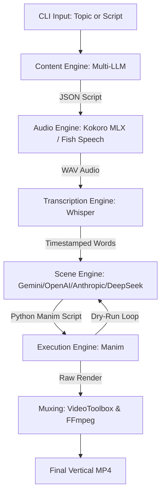
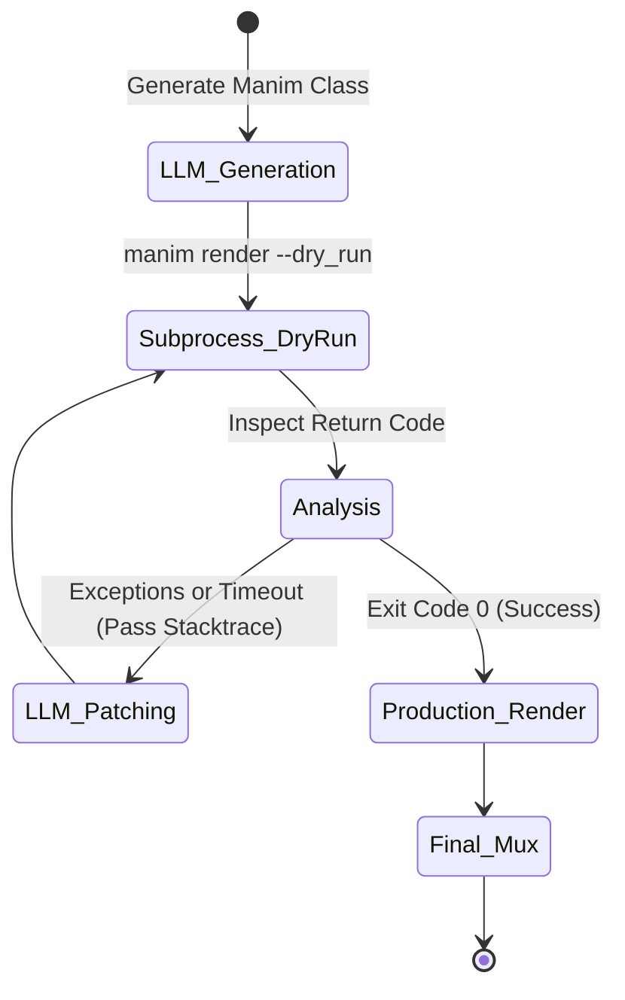

# AutoVideo: Programmatic Vertical Video Generation

AutoVideo is a production-grade, fully automated pipeline designed to generate highly engaging 9:16 vertical videos. It leverages **Manim** for programmatic animations, **multi-provider LLM support** (Gemini, OpenAI, Anthropic, DeepSeek) for dynamic script and scene generation, **Kokoro MLX + Fish Speech** for multi-language text-to-speech, and **Whisper** for precise word-level captioning.

Built specifically for **macOS and Apple Silicon**, this system features a self-healing scene engine that writes, tests, and iteratively patches its own animation code before final rendering.

---

## System Architecture



---

## Key Features

- **Autonomous Content Pipeline** — Provide a high-level text prompt. The system autonomously writes the script, synthesizes the voiceover, generates transcription timestamps, and renders dynamic visual scenes.
- **Multi-Language Support** — Generate videos in 10 languages including English, Hindi, Spanish, French, German, Italian, Portuguese, Japanese, Chinese, and Korean. Whisper handles transcription for all languages natively.
- **Dual TTS Engine** — Choose between **Kokoro MLX** (English-optimized, Apple Silicon native) and **Fish Speech** (Hindi and global language support). Switch with a single CLI flag.
- **Multi-Provider LLM Support** — Seamlessly switch between **Google Gemini**, **OpenAI**, **Anthropic Claude**, and **DeepSeek** for content generation and scene code authoring.
- **Parallel Asset Generation** — Optimized multi-threaded pipeline for TTS and transcription, significantly reducing wait times for multi-section videos.
- **Self-Healing Manim Generation** — Employs an iterative `--dry_run` loop. If generated Python scene code fails or times out, the system pipes the stack trace back to the LLM for localized patching until execution succeeds.
- **Premium Visual Effects** — Built-in animation helpers (`create_glass_card`, `create_glowing_ring`, `add_drop_shadow`) for polished, production-quality scene visuals.
- **Apple Silicon Optimization** — Hardware-accelerated at every stage. Utilizes `mlx-audio` for TTS, `mps` hardware targets for Whisper, and native Swift/`videotoolbox` for highly efficient H.264 encoding.
- **Smart Layout Scaling** — Automatic text and element scaling to ensure perfectly framed content within vertical (9:16) constraints, preventing cropping and overlaps.
- **Premium CLI Experience** — A beautiful, color-coded terminal interface powered by `Rich`, featuring progress bars, status banners, and detailed production summaries.
- **Word-Level Synchronization** — Extracts exact start and end timestamps via `whisper-timestamped` to drive perfectly timed on-screen typography and visual cues.

---

## Project Structure

```
auto-video/
├── src/
│   └── auto_video/
│       ├── __init__.py              # Package entry
│       ├── cli.py                   # CLI entrypoint (Typer)
│       ├── config.py                # Global settings, paths, theme, languages
│       ├── progress.py              # Rich-based progress UI
│       ├── utils.py                 # Script loading, validation, language helpers
│       ├── engine/                  # Pipeline orchestration
│       │   ├── __init__.py
│       │   ├── video_engine.py      # VideoOrchestrator (main coordinator)
│       │   ├── content_generator.py # LLM-powered script generation
│       │   ├── scene_generator.py   # LLM-powered Manim scene code
│       │   ├── tts_engine.py        # Kokoro MLX + Fish Speech TTS
│       │   ├── transcription_engine.py # Whisper word-level transcription
│       │   ├── apple_exporter.swift # Native macOS Swift exporter
│       │   └── llm/                 # LLM provider implementations
│       │       ├── __init__.py
│       │       ├── base.py          # LLMProvider protocol
│       │       ├── factory.py       # Provider resolution & instantiation
│       │       ├── gemini.py        # Google Gemini
│       │       ├── openai_provider.py   # OpenAI
│       │       ├── anthropic_provider.py # Anthropic Claude
│       │       └── deepseek_provider.py # DeepSeek (OpenAI-compatible)
│       └── scenes/                  # Manim scene classes
│           ├── __init__.py
│           ├── base_scene.py        # BaseProductionScene (captions, particles, premium helpers)
│           ├── main_scene.py        # ProductionScene (entry for Manim render)
│           └── template_scenes.py   # Intro, DynamicContent, Outro scenes
├── tests/                           # Test suite
│   ├── __init__.py
│   └── test_tts.py
├── docs/                            # AI agent documentation
│   ├── AGENTS.md
│   ├── CLAUDE.md
│   └── GEMINI.md
├── cache/                           # TTS & transcription cache (gitignored)
├── output/                          # Rendered videos & assets (gitignored)
├── media/                           # Manim intermediate media (gitignored)
├── pyproject.toml
├── requirements.txt
├── example_script.json
└── README.md
```

---

## Prerequisites & Setup

### 1. System Dependencies

The pipeline relies on core rendering libraries required by Manim Community. Install them via Homebrew:

```bash
brew install ffmpeg pango pkg-config cairo
```

### 2. Python Environment

This project utilizes `uv` for dependency management and environment isolation.

```bash
uv sync
```

### 3. Environment Configuration

Define your API keys in a `.env` file at the project root, or export them as environment variables:

```bash
# Required (at least one LLM provider):
export GEMINI_API_KEY="your_gemini_key"
export OPENAI_API_KEY="your_openai_key"
export ANTHROPIC_API_KEY="your_anthropic_key"
export DEEPSEEK_API_KEY="your_deepseek_key"

# Optional overrides:
export AUTO_VIDEO_LLM_PROVIDER="deepseek"  # Set default provider
```

---

## Usage

The primary interface is the `render` CLI command.

### Generate from a Topic

To dynamically generate an entire project from a single prompt:

```bash
# Using DeepSeek (defaults to deepseek-v4-pro)
uv run render "The future of quantum computing" --provider deepseek

# Using OpenAI
uv run render "The future of quantum computing" --provider openai --model gpt-4o

# Using Anthropic Claude
uv run render "The future of quantum computing" --provider anthropic --model claude-3-5-sonnet-20240620

# Using Gemini (default)
uv run render "The future of quantum computing" --provider gemini --model gemini-3-flash-preview
```

### Multi-Language Video Generation

Generate videos in any of the 10 supported languages:

```bash
# Hindi with Fish Speech TTS
uv run render "भारत की अर्थव्यवस्था" --language hi --tts-engine fish

# Japanese (uses Kokoro for TTS, Japanese-optimized font)
uv run render "量子コンピューティングの未来" --language ja

# Spanish
uv run render "El futuro de la computación cuántica" --language es

# Chinese with custom voice
uv run render "量子计算的未来" --language zh --voice af_bella
```

### Render from a Script File

To bypass the AI content generation and render a deterministic JSON or YAML script:

```bash
uv run render path/to/script.json --quality h
```

### Default Provider via Environment

Set a default provider so you don't need `--provider` every time:

```bash
export AUTO_VIDEO_LLM_PROVIDER="deepseek"
uv run render "Your topic"  # Will use DeepSeek
```

### CLI Arguments

| Argument | Description |
|----------|-------------|
| `input_value` | Topic string (for dynamic generation) or path to a `.json`/`.yaml` script file |
| `--provider` | LLM provider: `gemini`, `openai`, `anthropic`, `deepseek`. Default: `gemini` |
| `--model` | Specific model name (e.g., `gpt-4o`, `claude-3-5-sonnet`, `deepseek-v4-pro`, `deepseek-v4-flash`) |
| `--language` | Output language code: `en`, `es`, `fr`, `de`, `it`, `pt`, `ja`, `zh`, `ko`, `hi`. Default: `en` |
| `--tts-engine` | TTS engine: `kokoro` (English-optimized) or `fish` (Hindi/global). Default: `kokoro` |
| `--voice` | TTS voice ID. Kokoro voices: `af_bella`, `af_heart`, `af_sarah`, `am_liam`. Default: `af_bella` |
| `--quality` | Manim rendering quality presets (see table below) |
| `--force-regenerate` / `-f` | Bypass all caches and regenerate from scratch |

### Quality Presets

| Flag | Resolution | Framerate | Use Case |
|------|-----------|-----------|----------|
| `l` | 480×854 | 15 fps | Fast prototyping |
| `m` | 720×1280 | 30 fps | Standard preview |
| `h` | 1080×1920 | 60 fps | Production (default) |
| `p` | 1440×2560 | 60 fps | 2K high quality |
| `k` | 2160×3840 | 60 fps | 4K ultra quality |

---

## Language Support

AutoVideo supports video generation in **10 languages**. Transcription via Whisper works natively for all of them. For TTS, English uses Kokoro MLX and Hindi uses Fish Speech; other languages are configured for future TTS model integration.

| Code | Language | Font | TTS Engine | TTS Ready |
|------|----------|------|------------|-----------|
| `en` | English | Helvetica | Kokoro MLX | ✅ |
| `hi` | Hindi | Kohinoor Devanagari | Fish Speech | ✅ |
| `es` | Spanish | Helvetica | — | ⏳ |
| `fr` | French | Helvetica | — | ⏳ |
| `de` | German | Helvetica | — | ⏳ |
| `it` | Italian | Helvetica | — | ⏳ |
| `pt` | Portuguese | Helvetica | — | ⏳ |
| `ja` | Japanese | Hiragino Sans | — | ⏳ |
| `zh` | Chinese | PingFang SC | — | ⏳ |
| `ko` | Korean | Apple SD Gothic Neo | — | ⏳ |

Languages marked ⏳ will produce videos with Whisper transcription and on-screen text in the correct script, but TTS audio generation requires a future Fish Speech model update.

---

## TTS Engine Architecture

AutoVideo features a **dual TTS engine** architecture, selectable at runtime:

### Kokoro MLX (default)
- **Model**: `mlx-community/Kokoro-82M-bf16` (82M parameters)
- **Optimized for**: English (4 voices: `af_bella`, `af_heart`, `af_sarah`, `am_liam`)
- **Hardware**: Apple Silicon only (MLX framework)
- **Sample rate**: 24,000 Hz
- **Selection**: `--tts-engine kokoro` (default)

### Fish Speech
- **Model**: `fishaudio/fish-speech-1.5`
- **Optimized for**: Hindi and global/multi-language TTS
- **Hardware**: Cross-platform
- **Sample rate**: 44,100 Hz
- **Selection**: `--tts-engine fish`
- **Status**: Hindi voice is active; full model inference is being integrated

```bash
# English video with Kokoro
uv run render "The history of the internet" --tts-engine kokoro

# Hindi video with Fish Speech
uv run render "भारत का इतिहास" --language hi --tts-engine fish
```

---

## The Self-Healing Render Loop

Manim animations can be structurally complex and prone to API mismatches when generated via LLMs. AutoVideo solves this using a rapid dry-run iteration model.



The system:
1. **Generates** a Manim Python class via the selected LLM provider
2. **Runs** `manim render --dry_run` to validate the code without producing a video
3. **Analyzes** the return code — if it fails or times out, the error output is captured
4. **Patches** by sending the stack trace back to the LLM for a targeted fix
5. **Repeats** up to 5 times before giving up
6. **Renders** the final production video once validation passes

---

## Provider Details

### DeepSeek

- **API Base**: `https://api.deepseek.com` (OpenAI-compatible)
- **Default Model**: `deepseek-v4-pro`
- **Alternative Model**: `deepseek-v4-flash` (faster, non-thinking)
- **API Key**: `DEEPSEEK_API_KEY` environment variable
- **SDK**: Uses the `openai` Python package with a custom `base_url`

### Gemini

- **Default Model**: `gemini-3-flash-preview`
- **API Key**: `GEMINI_API_KEY` environment variable

### OpenAI

- **Default Model**: `gpt-4o`
- **API Key**: `OPENAI_API_KEY` environment variable

### Anthropic Claude

- **Default Model**: `claude-3-5-sonnet-20240620`
- **API Key**: `ANTHROPIC_API_KEY` or `CLAUDE` environment variable

All providers support both `generate_json` (for structured script generation) and `generate_text` (for Manim scene code and self-healing patches).

---

## Configuration & Theming

Global aesthetic settings are maintained in `src/auto_video/config.py`.

Modify the `THEME` mapping to adjust:
- `primary_color` and `secondary_color`
- Typography and font configurations
- Margin and padding scales for vertical constraints

Modify `VIDEO_CONFIG` to adjust:
- Render resolution and framerate defaults
- Intro, outro, and section timing

Modify `SUPPORTED_LANGUAGES` to adjust:
- Language-specific fonts and voices
- Whisper language codes
- TTS readiness flags

---

## Optimization Practices

- **Iterative Prototyping** — Always use `--quality l` when modifying scene logic or LLM prompts. This yields feedback in seconds rather than minutes.
- **Parallel Processing** — The system automatically utilizes multi-threading for audio generation and transcription. Ensure you have sufficient API quota if using remote providers.
- **Hardware Acceleration** — `WHISPER_DEVICE="mps"` is the default for transcription tasks, utilizing the Apple Neural Engine via Metal Performance Shaders.
- **Cache Management** — TTS audio and transcription results are cached in `cache/`. Use `--force-regenerate` / `-f` to clear caches and rebuild from scratch.
- **Cost Control** — For iterative development, use `deepseek-v4-flash` or `gemini-3-flash-preview` which offer faster response times at lower cost. Reserve production models (`deepseek-v4-pro`, `gpt-4o`, `claude-3-5-sonnet`) for final renders.
- **Language Testing** — When experimenting with non-English languages, use `--quality l` first to verify font rendering, text layout, and transcription accuracy before committing to a full production render.

---

## Troubleshooting

| Symptom | Likely Cause | Solution |
|---------|-------------|----------|
| `ValueError: DEEPSEEK_API_KEY is required` | Missing API key | Add `DEEPSEEK_API_KEY` to `.env` or export it |
| Manim validation fails repeatedly | Generated scene code has bugs | Check the debug scene saved to `output/<project>/debug_failed_scene.py` |
| `RuntimeError: Kokoro MLX is intended for Apple Silicon` | Running on non-Apple hardware | This pipeline is designed for macOS/Apple Silicon only. Use `--tts-engine fish` for cross-platform TTS |
| Slow rendering | High quality preset | Use `--quality l` during development |
| Audio/video out of sync | Timing drift in scene code | Ensure `section_start_time` and `padded_duration` are used correctly in generated scenes |
| Hindi TTS produces silence | Fish Speech placeholder active | Full Fish Speech inference model integration is in progress; the current placeholder outputs silence |
| Non-English text rendering issues | Missing system font | Ensure the required font is installed on macOS (all listed fonts are system defaults). Verify via Font Book |
| `RecursionError` in Manim scene | VGroup wrapped inside itself | Check that `add_drop_shadow()` is not called with its own parent VGroup. The LLM has been instructed to avoid this pattern |

---

## Extending

### Adding a New LLM Provider

1. Create a new file in `src/auto_video/engine/llm/` (e.g., `ollama_provider.py`)
2. Implement the `LLMProvider` protocol (`generate_json` and `generate_text`)
3. Register it in `factory.py` by adding a new `elif` branch
4. Export it from `llm/__init__.py`

### Adding a New Language

1. Add a new entry to `SUPPORTED_LANGUAGES` in `src/auto_video/config.py` with the appropriate font, voice, and Whisper language code
2. Set `has_tts` to `True` if the Kokoro or Fish model supports the language
3. Update the CLI help text for `--language` in `cli.py`
4. Add the language code to this README's language support table

### Adding a New Scene Template

1. Add a new scene class in `src/auto_video/scenes/template_scenes.py`
2. Wire it into `main_scene.py`'s `ProductionScene.construct()` method

--- 

*Built with Manim, Kokoro MLX, Fish Speech, and ❤️ for Apple Silicon.*