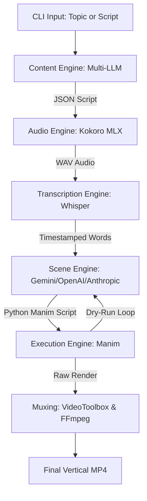
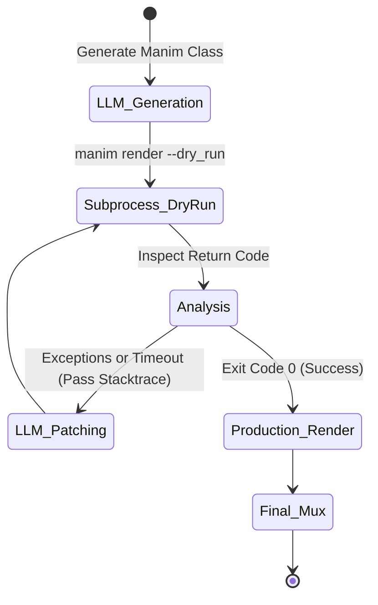

# AutoVideo: Programmatic Vertical Video Generation

AutoVideo is a production-grade, fully automated pipeline designed to generate highly engaging 9:16 vertical videos. It leverages Manim for programmatic animations, multi-provider LLM support (Gemini, OpenAI, Anthropic) for dynamic script and scene generation, Kokoro MLX for lifelike text-to-speech, and Whisper for precise word-level captioning.

Built specifically for macOS and Apple Silicon, this system features a self-healing scene engine that writes, tests, and iteratively patches its own animation code before final rendering.

## System Architecture



## Key Features

*   **Autonomous Content Pipeline**: Provide a high-level text prompt. The system autonomously writes the script, synthesizes the voiceover, generates transcription timestamps, and renders dynamic visual scenes.
*   **Multi-Provider LLM Support**: Seamlessly switch between **Google Gemini**, **OpenAI**, and **Anthropic** for content generation and scene code authoring.
*   **Parallel Asset Generation**: Optimized multi-threaded pipeline for TTS and transcription, significantly reducing wait times for multi-section videos.
*   **Self-Healing Manim Generation**: Employs an iterative `--dry_run` loop. If generated Python scene code fails or times out, the system pipes the stack trace back to the LLM for localized patching until execution succeeds.
*   **Apple Silicon Optimization**: Hardware-accelerated at every stage. Utilizes `mlx-audio` for TTS, `mps` hardware targets for Whisper, and native Swift/`videotoolbox` for highly efficient H.264 encoding.
*   **Smart Layout Scaling**: Automatic text and element scaling to ensure perfectly framed content within vertical (9:16) constraints, preventing cropping and overlaps.
*   **Premium CLI Experience**: A beautiful, color-coded terminal interface powered by `Rich`, featuring progress bars, status banners, and detailed production summaries.
*   **Word-Level Synchronization**: Extracts exact start and end timestamps via `whisper-timestamped` to drive perfectly timed on-screen typography and visual cues.

## Prerequisites & Setup

### 1. System Dependencies

The pipeline relies on core rendering libraries required by Manim Community. Install them via Homebrew:

```bash
brew install ffmpeg pango pkg-config cairo
```

### 2. Python Environment

This project utilizes `uv` for dependency management and environment isolation.

```bash
uv sync
```

### 3. Environment Configuration

Define your API keys in a `.env` file or export them:

```bash
export GEMINI_API_KEY="your_gemini_key"
export OPENAI_API_KEY="your_openai_key"
export ANTHROPIC_API_KEY="your_anthropic_key"
```

## Usage

The primary interface is the `render` CLI command.

### Generate from a Topic

To dynamically generate an entire project from a single prompt:

```bash
uv run render "The future of quantum computing" --provider openai --model gpt-4o --quality h
```

### Render from a Script File

To bypass the AI content generation and render a deterministic JSON or YAML script:

```bash
uv run render path/to/script.json --quality h
```

### CLI Arguments

*   `input_value`: The prompt string (for dynamic generation) or the file path to a `.json`/`.yaml` script.
*   `--provider`: LLM provider to use (`gemini`, `openai`, `anthropic`). Defaults to `gemini`.
*   `--model`: Specific model name (e.g., `gpt-4o`, `claude-3-5-sonnet`, `gemini-1.5-flash`).
*   `--quality`: Controls the Manim rendering resolution and framerate.
    *   `l`: 480p @ 15fps (Fast prototyping)
    *   `m`: 720p @ 30fps (Standard)
    *   `h`: 1080p @ 60fps (Production default)
    *   `p`: 1440p @ 60fps (2K)
    *   `k`: 2160p @ 60fps (4K)
*   `--voice`: Kokoro TTS voice ID (default: `af_bella`).
*   `--force-regenerate`: Bypasses the local cache, forcing a complete rebuild of all audio and transcription assets.

## The Self-Healing Render Loop

Manim animations can be structurally complex and prone to API mismatches when generated via LLMs. AutoVideo solves this using a rapid dry-run iteration model.



## Configuration & Theming

Global aesthetic settings are maintained in `src/auto_video/config.py`. 

Modify the `THEME` mapping to adjust:
*   `primary_color` and `secondary_color`
*   Typography and font configurations
*   Margin and padding scales for vertical constraints

## Optimization Practices

*   **Iterative Prototyping**: Always utilize `--quality l` when modifying scene logic or LLM prompts. This yields feedback in seconds.
*   **Parallel Processing**: The system automatically utilizes multi-threading for audio generation and transcription. Ensure you have sufficient API quota if using remote providers.
*   **Hardware Acceleration**: Ensure `WHISPER_DEVICE="mps"` is set in your configuration to utilize the neural engine for transcription tasks.